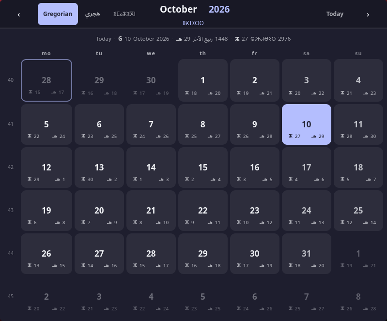
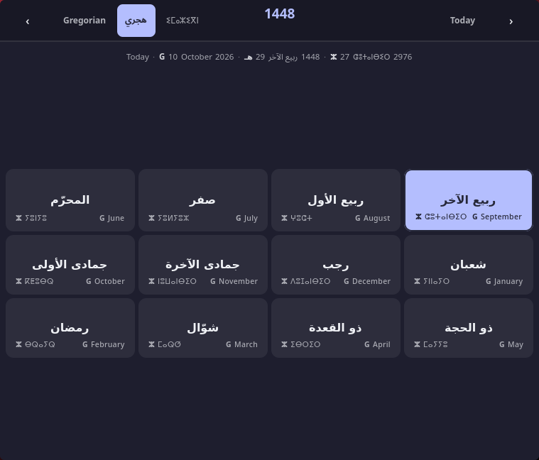
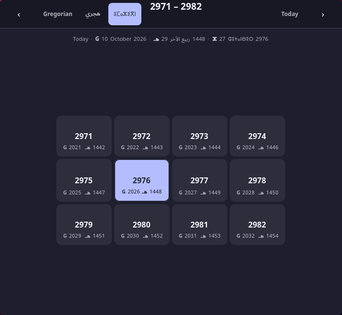

# hypr-calendar — Omniversify

A three-calendar overlay for **Hyprland**: Gregorian, Hijri (Umm al-Qura) and
Amazigh (Tifinagh), shown side by side in every cell, in one small floating
window.

**It is a standalone app, not a bar module.** `hypr-calendar` is an ordinary
program you run from a keybind or a launcher; it needs no status bar, no panel
API and no daemon. Waybar is optional and purely for convenience — binding the
toggle to the clock puts it one click away instead of one keystroke away.

| | |
|---|---|
| Toolkit | GTK 4 (PyGObject) |
| Language | Python (single file, no build step) |
| Window type | normal XDG toplevel (not layer-shell) |
| Calendars | Gregorian · Hijri (Umm al-Qura) · Amazigh (Julian) |
| Data | vendored `src/data.json`, validated against morocco-date-api + Aladhan |
| Status bar | none required — waybar, any other bar, or nothing at all |
| License | [The Unlicense](LICENSE.md) — public domain |

---

## Why this exists

The waybar clock used to open `lvsk-calendar` through a kitty wrapper. It worked,
but it was a terminal emulator holding a script, and everything about it —
the theme, the help bar, the calendar system — was somebody else's decision.

`hypr-calendar` is the replacement: the same overlay behaviour people actually
liked (a window that floats in, takes focus, drags by its header, and leaves the
tiled windows behind it fully interactive) with the calendar logic rewritten.

The two things worth having are the ones a `waybar`/`eww` widget cannot give you:

- **A real window.** It takes keyboard focus, it is draggable, and `Escape`
  closes it. It does not join the tiling layout, so it never pushes your tiles
  around.
- **Three systems at once.** Every cell shows the value of the system you are
  browsing, plus the same value in the other two systems in the bottom corners
  — so a day reads `28 هـ` next to `9` and `26 ⵣ` without switching.

---

## Features

- **Year → month → day drill-down.** Click the year in the title for the year
  picker, click a year for the month picker, click a month for the day grid.
  `Escape` climbs back one level at a time and only closes from the top.
- **Years arrive twelve at a time.** The year picker shows a page of 12 with
  the current year in the middle, and `←`/`→` turn whole pages (`2021 – 2032`,
  then `2033 – 2044`) instead of walking year by year; `↑`/`↓` step one at a
  time when you want that.
- **Calendar switcher** in the header: `Gregorian`, `هجري`, `ⵉⵎⴰⵣⵉⴳⵏ`.
- **No help bar, no theme switcher.** The visual theme is the system GTK theme;
  this widget follows it instead of carrying a palette of its own.
- **Bidi-safe labels.** Arabic and Tifinagh tags never swallow the digits
  beside them, because each tag and each number is its own `Gtk.Label` (see
  `DEV_NOTES.md`).
- **Corner layout in every view.** The value you are picking is centred in the
  square — day number, month name or year — and the other two systems split the
  bottom row: Amazigh always bottom-left, Hijri always bottom-right, Gregorian
  fills whichever corner is free. One rule, shared by the day grid, the month
  picker and the year picker — and no corner is ever truncated: cells grow to
  fit the names they carry (see `DEV_NOTES.md`).
- **Month names in their own script.** `January` in Latin, `المحرّم` in Arabic,
  `ⵢⵏⵏⴰⵢⵔ` in Tifinagh — each system is read in the script it belongs to
  rather than transliterated, and the other two appear as the corners.

---

## Screenshots

The three screens, in that order: the **day grid**, the **month picker** and the
**year picker**. Each one is shown with a different system in front, so the rule
from the Features list is visible — the name you are picking is written in its
own script, the other two systems sit in the corners.

**Day grid** (browsing Gregorian — `October` in Latin, `ربيع الآخر` and
`ⵛⵓⵜⴰⵏⴱⵉⵔ` underneath):



**Month picker** (browsing Hijri — the twelve months in Arabic, Gregorian and
Amazigh years in the corners):



**Year picker** (browsing Amazigh — twelve years paged at a time, `G 2026` and
`هـ 1448` in the corners):



The window wears the GTK theme it is running under (Catppuccin Mocha here), so
it follows your desktop rather than shipping a palette of its own.

---

## Install

### From AUR

```sh
yay -S omniversify-hypr-calendar
```

The package installs two things:

| | |
|---|---|
| `/usr/bin/hypr-calendar` | the widget itself |
| `/usr/bin/hypr-calendar-toggle` | the launcher: opens it floating, centred, and toggles it |

**Bind `hypr-calendar-toggle` — not `hypr-calendar`.** The bare widget opens as
an ordinary tiled window, because Hyprland does not float it on its own; the
toggle script is what floats, resizes and centres it, and what makes a second
invocation close it instead of stacking a second copy. Any keybind will do:

```lua
-- ~/.config/hypr/hyprland.lua
hl.bind({ mods = "SUPER", key = "C", desc = "calendar",
          cmd = "hypr-calendar-toggle" })
```

If you happen to run waybar, pointing the clock at the same script is a
convenience and nothing more:

```jsonc
"clock": { "on-click": "hypr-calendar-toggle" }
```

### Manually

```sh
./scripts/install.sh
```

which puts:

| file | destination |
|---|---|
| `src/hypr-calendar` | `~/.local/bin/hypr-calendar` |
| `scripts/calendar.sh` | `~/.local/bin/hypr-calendar-toggle` |
| `src/data.json` | `~/.local/share/hypr-calendar/data.json` |
| `config/style.css` | `~/.config/hypr-calendar/style.css` (only if absent) |

Make sure `~/.local/bin` is on `PATH`. A manual install and the AUR package put
the same two commands in the same place, so the keybind above works for both.

`./scripts/uninstall.sh` reverses it (`--purge` also drops your config).

The widget creates `~/.config/hypr-calendar/config` on first run if it is
missing.

### Requirements

- `python`, `python-gobject`, `gtk4`, `hyprland` — the widget and its launcher.
  Nothing here is a bar; **no status bar is required at all.**
- `noto-fonts` — listed as optional in the package, and you should install it
  anyway. The stylesheet asks for `Noto Sans Arabic` and `Noto Sans Tifinagh`
  by name, and on a bare install nothing else covers those codepoints, so the
  `هجري` and `ⵉⵎⴰⵣⵉⴳⵏ` buttons and every Arabic and Tifinagh month name come
  up as boxes. Gregorian still works; half the point of the widget does not.
- A waybar setup that can run a script on click — **only if you want the clock
  bound to it.** Skip it and bind a key instead; nothing else changes.

---

## Usage

- **`hypr-calendar-toggle`** → opens the overlay (floating, centred); running it
  again closes it. Bind it to a key, a launcher, or a bar click — the script
  does not care which.
- **Drag** the header bar to move it; it is a normal window, so it behaves like
  one.
- **`Escape`** → day grid → month picker → year picker → close.
- Click the **year in the title** to jump straight to the year picker.

Running `hypr-calendar` directly instead of the toggle works, but you get a
plain tiled window with no toggle behaviour — the launcher script is what does
the floating, resizing and centring.

---

## Configuration

`~/.config/hypr-calendar/config` — one key:

```
calendar = gregorian | hijri | amazigh   # which system to open on
```

`~/.config/hypr-calendar/style.css` — optional, loaded **after** the widget's
own stylesheet, so anything written there wins. It ships as comments only.

```css
.day            { border-radius: 4px; }
.day.today      { background-color: #f5c2e7; color: #1e1e2e; }
.cal-head       { background-color: #181825; }
```

GTK CSS accepts `/* */` comments only.

---

## Repository layout

```
src/hypr-calendar      the widget (single Python file)
src/data.json          vendored calendar tables
config/style.css       optional user override (comments only)
scripts/calendar.sh    the launcher: float, resize, centre, toggle
scripts/install.sh     manual install into $HOME
scripts/uninstall.sh   reverses install.sh (--purge also drops the config)
packaging/             PKGBUILD for the AUR package
screenshots/           the three screens, as shown in this README
DEV_NOTES.md           architecture, quirks, and the things that bit us
```

---

## Connect With Us

- [Discord](https://discord.omniversify.com) — Join our community
- [X/Twitter](https://twitter.com/omniversify) — Follow updates
- [GitHub](https://github.com/phaylali) — Explore our work
- [RSS Feed](/rss.xml) — Subscribe to updates

## Support Us

<p align="center">
  <a href="https://ko-fi.com/omniversify">
    
  </a>
</p>

<p align="center">
  <strong>Keep us going</strong>
</p>

---

Licensed under [The Unlicense](LICENSE.md) — public domain dedication.

_Made by Moroccans, for the Omniverse_

[](https://donate.unrwa.org/-landing-page/en_EN)
